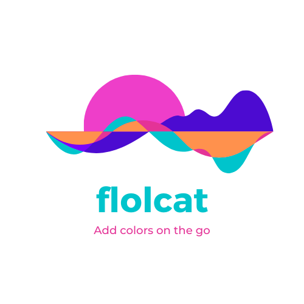

<!-- PROJECT SHIELDS -->

[![Contributors][contributors-shield]][contributors-url]
[![Forks][forks-shield]][forks-url]
[![Stargazers][stars-shield]][stars-url]
[![Issues][issues-shield]][issues-url]
[![MIT License][license-shield]][license-url]
[![LinkedIn][linkedin-shield]][linkedin-url]


<!-- PROJECT LOGO -->
<br />
<p align="center">
  <a href="https://github.com/Flolight/flolcat">
    
  </a>

  <h3 align="center">flolcat</h3>

  <p align="center">
    A command to add some rainbow colors to your terminal
    <br />
    <a href="https://github.com/Flolight/flolcat/issues">flolcatrt Bug</a>
    ·
    <a href="https://github.com/Flolight/flolcat/issues">Request Feature</a>
  </p>
</p>


<!-- ABOUT THE PROJECT -->
## About The Project

flolcat is a go implementation of the [lolcat](https://github.com/busyloop/lolcat) classic command
### Installation

```sh
go get github.com/flolight/lolcat
```


<!-- USAGE EXAMPLES -->
## Usage

echo "MyText" | flolcat


<!-- ROADMAP -->
## Roadmap

See the [open issues](https://github.com/Flolight/flolcat/issues) for a list of proposed features (and known issues).


<!-- CONTRIBUTING -->
## Contributing

Contributions are what make the open source community such an amazing place to be learn, inspire, and create. Any contributions you make are **greatly appreciated**.

1. Fork the Project
2. Create your Feature Branch (`git checkout -b feature/AmazingFeature`)
3. Commit your Changes (`git commit -m 'Add some AmazingFeature'`)
4. Push to the Branch (`git push origin feature/AmazingFeature`)
5. Open a Pull Request


<!-- LICENSE -->
## License

Distributed under the MIT License. See `LICENSE` for more information.


<!-- CONTACT -->
## Contact

Florian Clanet - [@FlolightC](https://twitter.com/FlolightC)

Project Link: [https://github.com/Flolight/flolcat](https://github.com/Flolight/flolcat)


<!-- MARKDOWN LINKS & IMAGES -->
<!-- https://www.markdownguide.org/basic-syntax/#reference-style-links -->
[contributors-shield]: https://img.shields.io/github/contributors/Flolight/flolcat.svg?style=flat-square
[contributors-url]: https://github.com/Flolight/flolcat/graphs/contributors
[forks-shield]: https://img.shields.io/github/forks/Flolight/flolcat.svg?style=flat-square
[forks-url]: https://github.com/Flolight/flolcat/network/members
[stars-shield]: https://img.shields.io/github/stars/Flolight/flolcat.svg?style=flat-square
[stars-url]: https://github.com/Flolight/flolcat/stargazers
[issues-shield]: https://img.shields.io/github/issues/Flolight/flolcat.svg?style=flat-square
[issues-url]: https://github.com/Flolight/flolcat/issues
[license-shield]: https://img.shields.io/github/license/Flolight/flolcat.svg?style=flat-square
[license-url]: https://github.com/Flolight/flolcat/blob/master/LICENSE.txt
[linkedin-shield]: https://img.shields.io/badge/-LinkedIn-black.svg?style=flat-square&logo=linkedin&colorB=555
[linkedin-url]: https://linkedin.com/in/florianclanet
[product-screenshot]: images/screenshot.png
